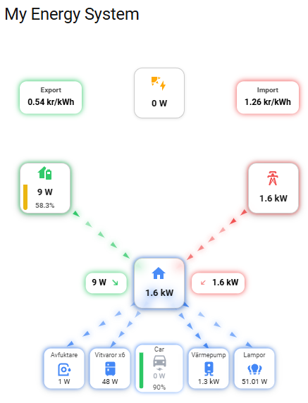

# ⚡ Solar Battery Economy Flow Card


A modern, animated energy flow card for Home Assistant — designed to work seamlessly with the **Solar Battery Economy** integration.

Visualize your entire energy system in real-time:

* ☀️ Solar production
* 🔋 Battery usage & state of charge
* 🏠 House consumption
* ⚡ Grid import/export
* 🚗 EV charging (with SOC)
* 🔌 Appliances (up to 4 + EV)

---

## ✨ Features

* 🔄 **Animated energy flows** with dynamic speed
* 🔋 **Battery SOC indicators** (color + fill level)
* 🚗 **EV charging visualization**

  * Charging state color (green when charging)
  * SOC display + battery bar
* 📱 **Responsive design**

  * Optimized for both mobile & desktop
* 🎯 **Auto-aligned labels**

  * Always positioned relative to icons
* ⚡ **Real-time updates**
* 🎨 Clean, modern UI with glow effects

## 📸 Screenshots

### 🖥️ Desktop



---

## 📦 Installation

### 🧩 HACS (Recommended)

1. Open **HACS → Frontend**

2. Click **⋮ → Custom repositories**

3. Add:

   * **Repository:**
     `https://github.com/Tobbe7612/solar-battery-economy-flow-card`
   * **Category:** Dashboard

4. Install **Solar Battery Economy Flow Card**

5. Restart Home Assistant

---

### 📁 Manual Installation

1. Download:

   ```
   dist/solar-battery-economy-flow-card.js
   ```

2. Copy to:

   ```
   /config/www/
   ```

3. Add resource:

   ```yaml
   url: /local/solar-battery-economy-flow-card.js
   type: module
   ```

---

## ⚙️ Configuration

```yaml
type: custom:solar-battery-economy-flow-card
title: Energy Flow

# 🔋 Battery
battery_soc_entity: sensor.battery_soc

# 🚗 EV
car_power_entity: sensor.car_power
car_soc_entity: sensor.car_soc

# 🔌 Appliances (max 4)
appliances:
  - name: Dishwasher
    entity: sensor.dishwasher_power
    icon: mdi:dishwasher

  - name: Washing Machine
    entity: sensor.washing_machine_power
    icon: mdi:washing-machine
```

---

## 🧠 How it works

The card visualizes energy flow between:

* ☀️ Solar → House / Battery / Grid
* 🔋 Battery ↔ House / Grid
* ⚡ Grid ↔ House / Battery
* 🏠 House → Appliances & EV

Flow direction, speed, and color are based on real sensor values.

---

## 🚗 EV Support

When configured:

* Shows EV as a centered appliance
* Displays:

  * Charging power
  * Battery percentage
  * Battery bar (color-coded)
* Flow animation appears when charging

---

## 🔋 Battery Visualization

* Vertical fill bar
* Color-coded SOC:

  * 🔴 Low (≤20%)
  * 🟡 Medium (≤70%)
  * 🟢 High (>70%)
* Subtle animation when charging

---

## 📱 Responsive Design

* Automatically scales to screen size
* Optimized spacing for:

  * Mobile
  * Tablet
  * Desktop

---

## 🔧 Requirements

* Home Assistant (latest recommended)
* Sensors for:

  * Solar power
  * Battery power
  * Grid import/export
  * House consumption

---

## 🧩 Designed for

This card is built specifically for the:

👉 **Solar Battery Economy** integration

It will still work standalone, but best experience is with that integration.

---

## 🚀 Roadmap

* [ ] Auto-detect integration sensors
* [ ] Visual configuration editor
* [ ] Multi-language support (EN / SV)
* [ ] More appliance customization

---

## 🤝 Contributing

Feel free to:

* Open issues
* Suggest features
* Submit pull requests

---

## 📄 License

MIT License

---

## ⭐ Support

If you like this card, consider giving the repo a ⭐ on GitHub!
