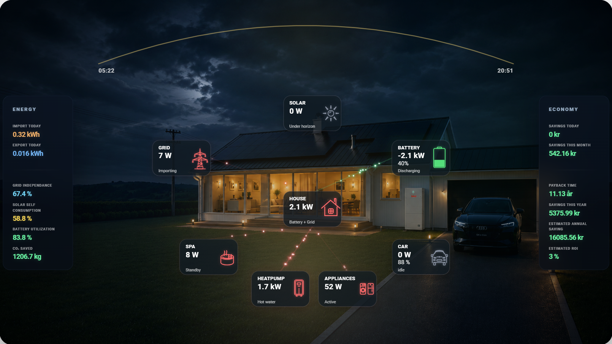
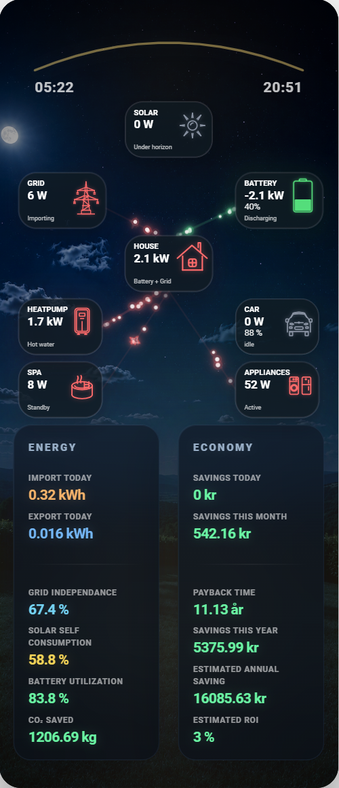

# ⚡ Solar Battery Economy Flow Card


A modern, animated energy-flow dashboard card for Home Assistant,
designed around the **Solar Battery Economy** integration.

> ## 🚨 Version 2 --- Completely Rebuilt and Refined
>
> **Version 2 is not a small update of the original card. The card has
> been totally rebuilt and extensively refined from the ground up.**
>
> The rendering architecture, energy-flow handling, labels, device
> system, configuration model, responsive layouts, animations and Solar
> Battery Economy integration handling have all been redesigned for a
> cleaner, more consistent and significantly more polished experience.
>
> **This README describes Version 2 only.**
>
> The configuration syntax from Version 1 is **not compatible with
> Version 2**.

------------------------------------------------------------------------

## ✨ Features

-   ☀️ **Solar production visualization**
-   🔋 **Battery power and SOC visualization**
-   🏠 **House consumption**
-   ⚡ **Grid import/export**
-   🔄 **Animated energy flows**
-   📈 **Flow visualization that follows the actual power values**
-   🎨 **Dynamic colors, glow and animation effects**
-   📊 **Energy and economy side panels**
-   🔎 **Automatic Solar Battery Economy sensor discovery**
-   🚗 **Configurable device visualization**
-   🧖 **Built-in SVG device icons**
-   📱 **Responsive desktop and mobile layouts**
-   🖱️ **More-info targets for the main energy labels**
-   ⚙️ **Configurable status rules for devices**

------------------------------------------------------------------------

## 🔄 A Completely New Version

Version 2 was developed as a **total rebuild**, rather than an
incremental modification of Version 1.

The goal was to create a card where the visual presentation and the
underlying data model work together consistently.

Among the major changes are:

-   A completely rebuilt rendering architecture
-   A new flow-rendering system
-   Power-responsive energy-flow animation
-   Refined particle and glow effects
-   Reworked labels and device visualization
-   A new four-device configuration model
-   Automatic discovery of Solar Battery Economy sensors
-   Simplified configuration
-   Built-in SVG icons instead of MDI icon configuration
-   Refined desktop and mobile layouts
-   Cleaner separation between automatically discovered data and
    user-configurable data

The result is intended to feel less like a collection of individual UI
elements and more like a single, coherent energy visualization.

------------------------------------------------------------------------

## 📸 Screenshots

### Desktop



### Mobile



------------------------------------------------------------------------

## 📦 Installation

### 🧩 HACS --- Recommended

1.  Open **HACS → Frontend**.
2.  Add the repository as a custom repository if it is not already
    available in HACS.
3.  Select **Dashboard** as the category.
4.  Install **Solar Battery Economy Flow Card**.
5.  Restart Home Assistant if required.

Repository:

`https://github.com/Tobbe7612/solar-battery-economy-flow-card`

### 📁 Manual Installation

1.  Build or download:

``` text
dist/solar-battery-economy-flow-card.js
```

2.  Copy the file to:

``` text
/config/www/
```

3.  Add it as a Lovelace resource:

``` yaml
url: /local/solar-battery-economy-flow-card.js
type: module
```

------------------------------------------------------------------------

# ⚙️ Configuration

Version 2 uses a substantially simplified configuration model.

The main energy flow is automatically discovered from the **Solar
Battery Economy** integration. Solar, battery, house and grid power are
therefore **not individually configured as sensor entities**.

A minimal card configuration can be as simple as:

``` yaml
type: custom:solar-battery-economy-flow-card
title: Energy Flow
```

------------------------------------------------------------------------

## 🧩 Main Configuration

### `title`

Optional title displayed by the card.

``` yaml
title: Energy Flow
```

### `layout`

Controls the main layout.

``` yaml
layout: desktop
```

Available values:

-   `desktop`
-   `mobile`

### `batterySocEntity`

The Solar Battery Economy integration does not provide the battery SOC
used by the card, so this remains a manual entity.

``` yaml
batterySocEntity: sensor.home_battery_soc
```

------------------------------------------------------------------------

## 🔎 More-info Entities

The main Solar Battery Economy power values are calculated internally
and therefore do not have a single entity ID of their own.

The following optional settings define which entity should be opened
when the user requests more information from the corresponding main-flow
label:

``` yaml
solarInfoEntity: sensor.solar_power
gridInfoEntity: sensor.grid_power
houseInfoEntity: sensor.house_power
batteryInfoEntity: sensor.battery_power
```

These are **not used to calculate the displayed power values**. They are
only targets for the Home Assistant more-info action.

If they are not configured, the card uses its built-in fallback targets.

------------------------------------------------------------------------

# 📊 Side Panels

The card contains two optional side panels:

-   **Energy**
-   **Economy**

Both can be shown or hidden independently.

``` yaml
sidePanels:
  energy:
    show: true

  economy:
    show: true
```

------------------------------------------------------------------------

## ⚡ Energy Panel

The Energy panel can display values discovered automatically from Solar
Battery Economy.

Automatically discovered:

-   Grid independence
-   Battery utilization
-   Solar self-consumption
-   CO₂ saved

Two daily energy values are intentionally manual:

``` yaml
sidePanels:
  energy:
    show: true
    importTodayEntity: sensor.grid_import_today
    exportTodayEntity: sensor.grid_export_today
```

`importTodayEntity` and `exportTodayEntity` are optional.

If they are not configured, the card does not substitute an unrelated
sensor.

------------------------------------------------------------------------

## 💰 Economy Panel

The Economy panel automatically discovers the Solar Battery Economy
sensors for:

-   Savings today
-   Total savings
-   Savings this month
-   Savings this year
-   Estimated annual savings
-   Payback time
-   Return on investment (ROI)

There are no individual economy sensor selectors in the card
configuration.

``` yaml
sidePanels:
  economy:
    show: true
```

------------------------------------------------------------------------

# 🔌 Solar Battery Economy Integration

Version 2 is designed around the **Solar Battery Economy** integration.

When the integration is detected, the card automatically discovers its
relevant entities.

### Automatic discovery

The card identifies the integration by looking for the expected entity
**suffixes**, rather than relying on a fixed entity-name prefix.

This means installations where Home Assistant adds an additional device
or installation prefix can still be discovered correctly.

### Main energy flow

The following energy-flow values are discovered automatically:

``` text
energy_system_power_solar_house
energy_system_power_solar_battery
energy_system_power_solar_export

energy_system_power_battery_house
energy_system_power_battery_grid

energy_system_power_grid_house
energy_system_power_grid_battery

energy_system_power_house_grid
```

These values are used to calculate the displayed:

-   Solar power
-   Battery power
-   House consumption
-   Grid power
-   Flow directions

The main flow sensors are therefore **not user-configurable**.

### Energy panel

Automatically discovered:

``` text
financial_30_grid_independence
financial_31_battery_utilization
financial_32_solar_self_consumption_rate
financial_33_co2_saved
```

Not provided by the integration and therefore manual:

``` text
Import Today
Export Today
```

### Economy panel

Automatically discovered:

``` text
financial_03_savings_today
financial_01_total_savings
financial_04_savings_this_month
financial_05_savings_this_year
financial_02_estimated_annual_savings
financial_10_payback_time
financial_12_return_on_investment
```

------------------------------------------------------------------------

# 🚗🧖 Device 1--4

Version 2 provides **four configurable device slots**.

The slots represent fixed positions in the visual layout. They are not
dynamically added, removed, reordered or resized.

Each slot can be independently enabled and configured.

``` yaml
devices:
  - enabled: true
    title: Car
    powerEntity: sensor.car_power
    optionalType: soc
    optionalEntity: sensor.car_soc
    statusEntity: sensor.car_status
    icon: car

  - enabled: true
    title: Spa
    powerEntity: sensor.spa_power
    icon: spa

  - enabled: true
    title: Heat Pump
    powerEntity: sensor.heatpump_power
    icon: heatpump

  - enabled: true
    title: Dishwasher
    powerEntity: sensor.dishwasher_power
    icon: appliance
```

------------------------------------------------------------------------

## Device properties

### `enabled`

Enables or disables the device.

``` yaml
enabled: true
```

### `title`

The title shown in the device label.

``` yaml
title: Heat Pump
```

### `powerEntity`

The power sensor controlling the device's displayed power and flow.

``` yaml
powerEntity: sensor.heatpump_power
```

The flow is only meaningful when a power entity is configured. The
visualization follows the actual power value rather than using a fixed
decorative flow.

### `optionalType`

Optional secondary value.

Available values:

``` text
soc
temperature
```

Example:

``` yaml
optionalType: soc
optionalEntity: sensor.car_soc
```

or:

``` yaml
optionalType: temperature
optionalEntity: sensor.spa_temperature
```

### `optionalEntity`

The entity used for the optional value.

### `statusEntity`

Optional entity used to display the device status.

``` yaml
statusEntity: sensor.car_status
```

If a `statusEntity` is configured, its value is used for the displayed
status.

### `statusRules`

If no `statusEntity` is configured, the device can calculate its status
from its power value.

Example:

``` yaml
statusRules:
  - threshold: 1
    label: Standby
  - threshold: 500
    label: Active
  - threshold: 2000
    label: High load
```

Rules are evaluated by threshold, with the highest matching threshold
determining the displayed status.

### `icon`

Version 2 uses the card's built-in SVG icon set.

Available icons:

``` text
car
spa
heatpump
appliance
```

There is **no MDI icon configuration in Version 2**.

------------------------------------------------------------------------

# 🔄 Energy Flow Visualization

The energy flows are not static decorative lines.

Their rendering follows the actual power values supplied by the energy
system.

This affects:

-   Whether a flow is present
-   Flow direction
-   Animation
-   Particle movement
-   Visual intensity
-   Glow

The card therefore reacts to changes in the underlying energy system
rather than showing the same animation regardless of the current load.

------------------------------------------------------------------------

# 🔋 Battery Visualization

The house battery is represented using its calculated power flow and
manually selected SOC entity.

Battery operating state is derived from battery power:

-   Positive power → Charging
-   Negative power → Discharging
-   Around zero → Standby

The battery visualization also uses dynamic color and glow effects to
reflect its current operating state.

------------------------------------------------------------------------

# 🏠 House, Solar and Grid

The main energy values are calculated internally from the automatically
discovered Solar Battery Economy flow sensors.

### Solar

Solar power is derived from the solar-to-house, solar-to-battery and
solar-to-grid flows.

### House

House consumption is derived from the active solar, battery and grid
contributions.

### Grid

Grid power is calculated from the detected grid import/export flows.

The displayed status follows the calculated direction, for example:

-   Importing
-   Exporting
-   Balance

------------------------------------------------------------------------

# 📱 Responsive Layout

Version 2 has been rebuilt with responsive presentation in mind.

The card supports:

-   Desktop
-   Mobile

The visual layout, labels and energy-flow rendering are designed to
remain coherent as the available card space changes.

------------------------------------------------------------------------

# 🛠️ Requirements

-   Home Assistant
-   **Solar Battery Economy** integration for the automatic main
    energy-flow data

For the complete V2 experience, the Solar Battery Economy integration is
strongly recommended because the main energy flow is built around its
energy-system sensors.

Additional manually configured entities are required for:

-   Battery SOC
-   Import Today
-   Export Today
-   Device power/status/optional values, when used

------------------------------------------------------------------------

# 🐛 Troubleshooting

### The main energy flows are not visible

Check that the **Solar Battery Economy** integration is installed and
that its energy-system sensors are available in Home Assistant.

The card discovers the integration by entity suffix, so the exact entity
prefix does not need to match a particular installation.

### A device does not show a flow

Check that:

``` yaml
enabled: true
```

and that a valid:

``` yaml
powerEntity:
```

is configured.

### Import Today / Export Today show no value

These two sensors are manual and are not provided by Solar Battery
Economy.

Configure them explicitly under:

``` yaml
sidePanels:
  energy:
```

### Battery SOC is not shown

Configure:

``` yaml
batterySocEntity: sensor.your_battery_soc
```

The battery SOC is not automatically supplied by Solar Battery Economy.

------------------------------------------------------------------------

# 🤝 Contributing

Issues, suggestions and pull requests are welcome.

When reporting an issue, please include:

-   Home Assistant version
-   Card version
-   Relevant configuration
-   Browser/device
-   Any errors shown in the Home Assistant browser console

------------------------------------------------------------------------

# 📄 License

MIT License

------------------------------------------------------------------------

# ⭐ Support

If you like the card, consider giving the repository a ⭐ on GitHub.

------------------------------------------------------------------------

## Version 2

**Solar Battery Economy Flow Card V2 is a complete rebuild and
refinement of the original card.**

The V2 architecture, rendering system, configuration model and
integration handling have been redesigned with the goal of providing a
cleaner, more responsive and more polished Home Assistant energy
visualization.

This README intentionally documents **V2 only** and does not describe
the legacy Version 1 configuration.
